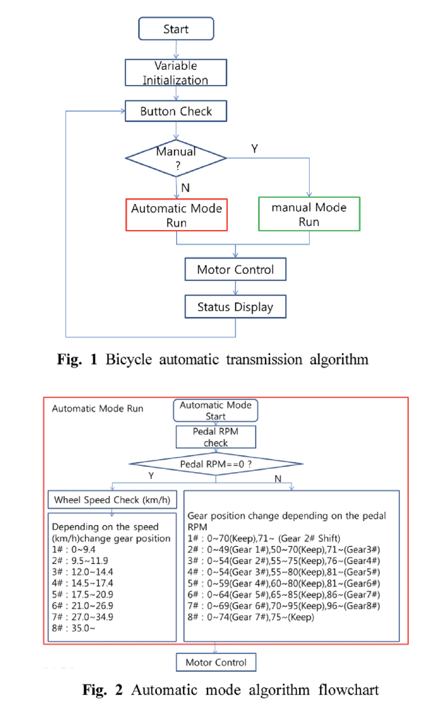
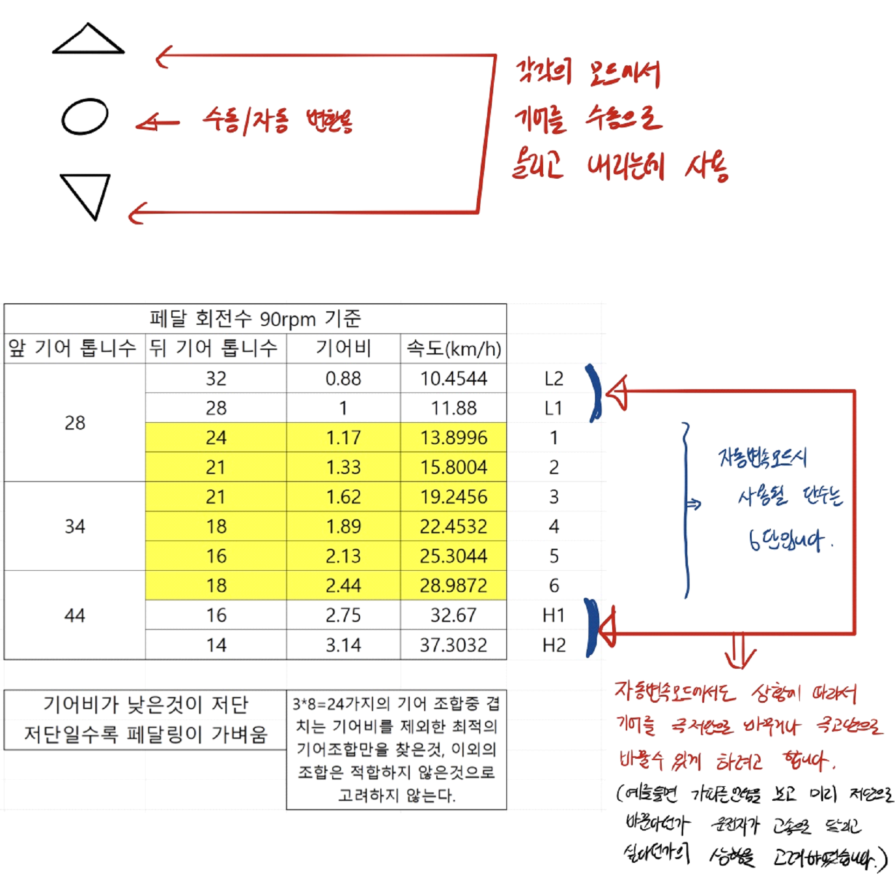

# Capstone 4anyone : automatic shifting bicycle

 

# Gear Ratio

## Gear Selection
|Gear|Front Gear|Rear gear|
|------|---|---|
|**L 1**|28T|32T|
|**L 2**|28T|28T|
|A 1|28T|24T|
|A 2|28T|21T|
|A 3|34T|21T|
|A 4|34T|18T|
|A 5|34T|16T|
|A 6|44T|18T|
|**H 1**|44T|16T|
|**H 2**|44T|14T|

## Front Gear
|Teeth|Degree|백래쉬(상승)|백래쉬(하강)|
|---|---|---|---|
|28T|100|-|100|
|34T|72|68|76|
|44T|58|54|-|

## Rear Gear
|Teeth|Degree|
|---|---|
|32T|145|
|28T|121|
|24T|98|
|21T|85|
|18T|73(up),77(down)
|16T|65|
|14T|47|  

* 홀센서는 외부 인터럽트를 사용, 2번핀과 3번핀 reserved  
* 개발 보드 : Arduino UNO (가능하다면 나중에 Nano로)

* RPM 90이 이상적 상황, [80 100)사이에서 유지되게
* EEPROM 통해서 현재 기어상황을 전원이 꺼지더라고 기록

* 사용자가 배터리 잔량을 LCD로 확인할 수 있게 하려고 하는데 이부분에 대해서 자문을 구합니다. 
* 페달링 rpm이 0이 되는 경우 

* 수동모드일 경우 위아래 버튼으로 기어단수 수동조작 가능, LCD에는 status만 표시  
* Status : 현재 단수, Cadence, 현재속력, 배터리 잔량
3-1 Status에는 현재단수, 케이던스(페달링rpm), 현재속도, 배터리 잔량이 나오게 할 것.
* 자동모드 일 경우 자동으로 기어변속
* flowchart 수치는 변경 예정
* 자전거가 정지하면 한단만 낮춘다

 
   

# 참고 할 자료
[EEPROM 사용법](https://m.blog.naver.com/damtaja/220217759177) 
===
 